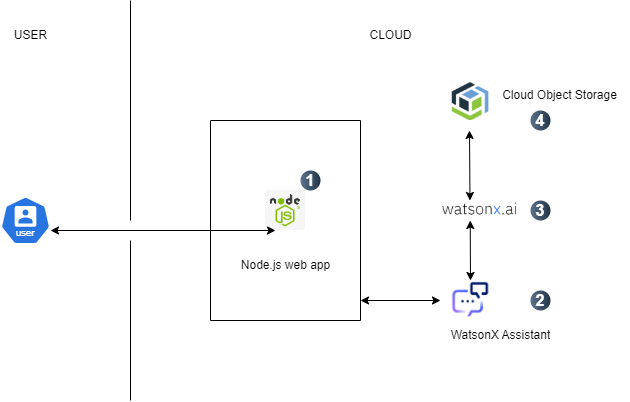

[](https://www.apache.org/licenses/LICENSE-2.0) [](https://developer.ibm.com/callforcode/solutions/projects/get-started/)

# PSL-Power-developers

- [Project summary](#project-summary)
  - [The issue we are hoping to solve](#the-issue-we-are-hoping-to-solve)
  - [How our technology solution can help](#how-our-technology-solution-can-help)
  - [Our idea](#our-idea)
- [Technology implementation](#technology-implementation)
  - [IBM watsonx product(s) used](#ibm-ai-services-used)
  - [Other IBM technology used](#other-ibm-technology-used)
  - [Solution architecture](#solution-architecture)
- [Presentation materials](#presentation-materials)
  - [Solution demo video](#solution-demo-video)
  - [Project development roadmap](#project-development-roadmap)
- [Additional details](#additional-details)
  - [How to run the project](#how-to-run-the-project)
  - [Live demo](#live-demo)
- [About this template](#about-this-template)
  - [Contributing](#contributing)
  - [Versioning](#versioning)
  - [Authors](#authors)
  - [License](#license)
  - [Acknowledgments](#acknowledgments)

## Project summary

### The issue we are hoping to solve

Flooding poses a significant threat to communities worldwide, exacerbated by climate change and urbanization. Many individuals, especially those in vulnerable populations, lack timely information to prepare for flood events, leading to loss of life and property damage.

### How our technology solution can help

Our solution provides timely, actionable flood alerts and resource information

### Our idea

Our solution is an innovative solution designed to address the critical issue of flooding through the integration of advanced predictive analytics and real-time data collection. Flooding events are increasing in frequency and severity, impacting millions globally, particularly in low-income communities that often lack access to timely and reliable information. Traditional flood warning systems can be slow to provide updates or may fail to reach the most vulnerable populations. FloodGuard seeks to fill this gap by leveraging AI technology to deliver proactive, user-friendly flood alerts and resource access.


## Technology implementation

### IBM watsonx product(s) used

_INSTRUCTIONS: Included here is a list of IBM watsonx products. Remove any products you did not use. Leave only those included in your solution code. In your official submission on the Call for Code Global Challenge web site, you are required to provide details on where and how you used each IBM watsonx product so judges can review your implementation. Remove these instructions._

**Featured watsonx products**

- [watsonx.ai](https://www.ibm.com/products/watsonx-ai) - Utilized for predictive analytics, analyzing vast datasets to forecast flood risks accurately.


- [watsonx Assistant](https://cloud.ibm.com/catalog/services/watsonx-assistant) - Provides a conversational interface for users to access information and report local conditions easily.


### Solution architecture

Diagram and step-by-step description of the flow of our solution:



1. Users interact with the React app. The React app sends the request to Watsonx Assistant for flood-related queries.
2. The assistant forwards the user’s query to the backend (or directly) to the flood detection model in Watsonx.ai.
3. The model retrieves relevant data from IBM Cloud Object Storage, like historical data or real-time weather conditions, for predictions.
4. Watsonx.ai returns the prediction back through the assistant to the user interface in the React app.

### Solution demo video

[](https://youtu.be/vOgCOoy_Bx0)

### Project development roadmap

The project currently implements the following features:
- **Feature 1**: Basic real-time flood prediction using environmental data.
- **Feature 2**: Integrated Watson Assistant for flood-related conversational interactions.

### Future Plans:
- Mobile integration with push notifications.
- Enhancements in predictive algorithms.
- Localized flood alerts with real-time geodata.
- Mapping of resources for flood-affected communities.


### How to run the project

INSTRUCTIONS: 


Clone the repository:
   ```bash
   git clone https://github.com/valen-mascarenhas14/PSL-Power-developers.git
   ```
Navigate to the project directory:
   ```bash
   cd PSL-Power-developers
   ```
Install the necessary dependencies:
   ```bash
   npm install 
   ```
Start the development server:
   ```bash
   npm start
   ```
The project will now be running locally on `http://localhost:3000`. You can view the Watson Assistant chat on the dashboard, which opens automatically upon loading.


### License

This project is licensed under the Apache 2 License - see the [LICENSE](LICENSE) file for details.

